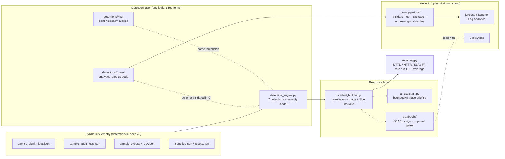

# AI-Assisted Azure Identity Threat Detection & SOAR Lab

A self-contained detection engineering lab that mirrors how a Microsoft
Sentinel estate should run: seven identity-focused detections written as
Sentinel-ready KQL, version-controlled YAML analytics rules and tested Python
mirrors; explainable severity scoring; incident correlation; AI-assisted triage
with explicit security boundaries; SOAR playbook designs with human-approval
gates; and a daily operations report computing MTTD, MTTR, SLA adherence,
false-positive rate and MITRE ATT&CK coverage.


Everything is simulated and safe: all identities and events are fictional,
generated deterministically (seed 42) - no real systems are touched, no attack
tooling exists in this repository.

## Why I built this

I work as a Cyber Security Engineer in IAM/PAM, investigating identity
security signals across CyberArk, SailPoint, Microsoft Entra ID and Active
Directory. Preparing for a Microsoft Cloud Security Engineer role, I wanted
proof - not claims - that this identity-security judgement translates into
Microsoft's detection stack. I built the lab in under a week, offline-first so
it runs on any machine with Python, with a documented path to a real Azure
deployment. The honest map of what is production experience versus what is
lab-demonstrated lives in
[docs/MY_REAL_EXPERIENCE_MAPPING.md](docs/MY_REAL_EXPERIENCE_MAPPING.md).

## Architecture



Attack chain embedded in the sample data (one of seven scenarios): a
compromised service-desk account adds a credential to a high-privilege service
principal (persistence), grants itself Global Administrator (privilege
escalation), then disables the MFA policy for admin roles (defence evasion) -
three detections, thirty minutes, correlated into one Critical incident.

## Quickstart

```bash
cd azure-identity-soar-lab
python3 -m venv .venv && source .venv/bin/activate
pip install -r requirements.txt      # pytest + PyYAML (the pipeline itself is stdlib-only)

python3 src/main.py --demo           # full pipeline: generate -> detect -> correlate -> AI -> report
python3 -m pytest -q                 # 17 tests: detection logic, severity, correlation, rule schemas
```

Individual stages, if you want to step through them:

```bash
python3 src/generate_logs.py             # regenerate the synthetic telemetry
python3 src/detection_engine.py          # run detections (rule set v1.0.0)
python3 src/detection_engine.py --tuned  # apply v1.1.0 tuning exclusions
python3 src/incident_builder.py          # correlate alerts into incidents
python3 src/main.py --incident INC-1004  # AI triage briefing for one incident
python3 src/reporting.py                 # daily security operations report
```

All output lands in `output/` (gitignored): `alerts.json`, `incidents.json`,
one markdown per incident, AI prompts and briefings under `output/ai/`, and
`daily_security_report.md`.

## The seven detections

| ID | Detection | MITRE technique(s) | Tactics | Base severity |
|----|-----------|--------------------|---------|---------------|
| DET-001 | MFA Fatigue (Push Bombing) | T1621 | Credential Access | High |
| DET-002 | Impossible Travel Sign-in | T1078.004 | Initial Access, Defence Evasion | Medium |
| DET-003 | Conditional Access Policy Modified or Deleted | T1556.009 | Defence Evasion, Persistence | High |
| DET-004 | New Credential Added to Service Principal | T1098.001 | Persistence, Privilege Escalation | High |
| DET-005 | Account Added to Privileged Role or Group | T1098.003, T1098.007 | Privilege Escalation, Persistence | High |
| DET-006 | Anomalous CyberArk Privileged Credential Checkout | T1078.002 | Privilege Escalation, Lateral Movement | Medium |
| DET-007 | Stale or Orphaned Privileged Account (posture) | T1078 | Initial Access | Low |

Each detection is three synchronised artefacts: `detections/DET-00X-*.kql`
(production-table Sentinel query), `detections/DET-00X-*.yaml` (the analytics
rule as reviewable code: severity, MITRE mapping, entity mappings, SLA, known
false positives, tuning exclusions) and a mirrored function in
`src/detection_engine.py` with identical thresholds. A CI test fails if any of
the three drifts from the others.

Severity is explainable by construction: base severity per detection plus four
auditable modifiers (privileged identity, off-hours activity, high-risk
sign-in, detection-specific escalation such as self-elevation), capped at
Critical. Every alert carries the list of modifiers that were applied.

## Example output (from the committed sample run)

Demo summary (`python3 src/main.py --demo`):

```
Detections fired      7 of 7 (12 alerts, 8 incidents)
MTTD                  1.4 h
MTTR                  12.7 h
SLA adherence         93.8%
False-positive rate   12.5% before tuning, 0.0% after v1.1.0
```

Daily report headline (`output/daily_security_report.md`):

```
- Alerts raised: 12 (7 Critical, 2 High, 3 Medium)
- Incidents opened: 8
- MTTD (mean time to acknowledge): 1.4 h
- MTTR (mean time to resolve): 12.7 h
- SLA adherence: 93.8% (1 breach(es))
- Incident false-positive rate: 12.5% (INC-1005)
```

AI triage briefing excerpt (`output/ai/INC-1003-summary.md`):

```
# AI triage briefing - INC-1003 (offline deterministic mode)

## b. Likely cause
An attacker holding a valid password generated repeated MFA push prompts until
the user approved one (MFA fatigue). Confidence: high, given the deny burst
followed by an approval from the same foreign IP.
```

The single SLA breach and the false positive are deliberate: a metrics page
that never shows a breach is a metrics page nobody audited. The false positive
(VPN egress tripping impossible travel) is the tuning story - rule v1.1.0 adds
a scoped exclusion, and a test asserts both true positives survive it.

## Detection-as-code and CI

[.azure-pipelines/validate-detections.yml](.azure-pipelines/validate-detections.yml)
runs four stages on every change to `detections/`, `src/` or `tests/`:

1. **Validate** - every rule has KQL + YAML + engine implementation; schemas,
   MITRE technique format and catalogue consistency checked.
2. **Test** - the full pytest suite plus an end-to-end demo smoke run; sample
   output published as a build artifact.
3. **Package** - detection rules published as a deployable artifact.
4. **Deploy** - a deployment job against the `sentinel-production` environment,
   which carries a manual-approval check; without a subscription configured it
   documents the exact `az sentinel alert-rule create` path and stays green.

## SOAR playbooks

Six Logic App-style playbook designs in [playbooks/](playbooks/): enrich,
notify DRI, open ticket, revoke sessions, require password reset, disable
user. The automation boundary is a three-question framework - blast radius,
reversibility, confidence - detailed in
[playbooks/soar-response-design.md](playbooks/soar-response-design.md).
Session revocation runs unattended at Critical severity; anything that can
lock a human out waits for DRI approval. AI output never triggers an action.

## Responsible AI

The AI assistant receives minimised aggregates (never raw logs), wraps
telemetry in untrusted-input delimiters against prompt injection, produces
advisory-only output, persists every prompt and briefing for audit, and fails
safe to a deterministic offline mode - no key or network required. Optional
Azure OpenAI integration activates only via environment variables. Full
write-up: [docs/RESPONSIBLE_AI.md](docs/RESPONSIBLE_AI.md).

## Operations

[docs/DRI_RUNBOOK.md](docs/DRI_RUNBOOK.md) defines the on-call model this lab
reports against: severity/SLA matrix (mirrored exactly in code), escalation
paths, the first-15-minutes checklist for a Critical page, and a blameless RCA
template that feeds tuning changes back through the pipeline.

## Repository structure

```
azure-identity-soar-lab/
├── README.md
├── requirements.txt
├── .azure-pipelines/
│   └── validate-detections.yml    CI: validate -> test -> package -> gated deploy
├── data/                          committed synthetic telemetry (regenerable)
│   ├── sample_signin_logs.json
│   ├── sample_audit_logs.json
│   ├── sample_cyberark_epv.json
│   ├── identities.json
│   └── assets.json
├── detections/                    7 x KQL + 7 x YAML analytics rules
├── docs/
│   ├── INTERVIEW_PITCH.md         60-second pitch + headline numbers
│   ├── INTERVIEW_QA.md            20 likely questions with answers
│   ├── INTERVIEW_STORY.md         8 STAR stories
│   ├── DEMO_SCRIPT.md             timed 5-minute walkthrough
│   ├── QUESTIONS_TO_ASK_MICROSOFT.md
│   ├── MY_REAL_EXPERIENCE_MAPPING.md
│   ├── DRI_RUNBOOK.md
│   └── RESPONSIBLE_AI.md
├── playbooks/
│   ├── soar-response-design.md
│   └── logic-app-pseudocode.json
├── src/
│   ├── main.py                    entry point (--demo)
│   ├── generate_logs.py           deterministic telemetry generator
│   ├── detection_engine.py        7 detections + severity model
│   ├── incident_builder.py        correlation, triage, SLA lifecycle
│   ├── ai_assistant.py            bounded AI briefings (offline / Azure OpenAI)
│   └── reporting.py               daily operations report
└── tests/
    └── test_detection_engine.py   17 tests incl. detection-as-code contract
```

## Mode B: deploying to Azure (documented path)

The lab is designed to port: KQL targets production table schemas
(`SigninLogs`, `AuditLogs`, custom `CyberArk_EPV_CL`), YAML rules mirror the
scheduled-analytics-rule contract, and watchlist lookups
(`CAPolicyAdmins`, `HighPrivilegeApps`, `PrivilegedIdentities`) replace the
lab's JSON reference data. Deployment order: Log Analytics workspace + Sentinel
onboarding, data connectors (Entra ID sign-in/audit, CyberArk via AMA or the
Logs Ingestion API), watchlists, then analytics rules via the pipeline's deploy
stage and playbooks as Logic Apps. Interview framing for why offline-first came
first is in [docs/INTERVIEW_QA.md](docs/INTERVIEW_QA.md), question 17.

## Interview artefacts

- [docs/INTERVIEW_PITCH.md](docs/INTERVIEW_PITCH.md) - the 60-second pitch and JD one-liners
- [docs/INTERVIEW_STORY.md](docs/INTERVIEW_STORY.md) - STAR stories (real experience + this lab)
- [docs/INTERVIEW_QA.md](docs/INTERVIEW_QA.md) - 20 likely questions with prepared answers
- [docs/DEMO_SCRIPT.md](docs/DEMO_SCRIPT.md) - the 5-minute live demo, timed
- [docs/QUESTIONS_TO_ASK_MICROSOFT.md](docs/QUESTIONS_TO_ASK_MICROSOFT.md)

## License

MIT - see [LICENSE](LICENSE).
