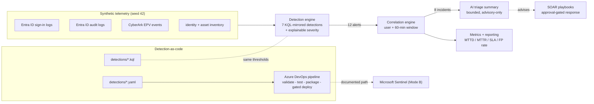

# AI-Assisted Azure Identity Threat Detection & SOAR Lab

A runnable Microsoft Sentinel-style cloud security lab using synthetic Entra
ID, audit, and privileged-access telemetry to demonstrate detection
engineering, incident correlation, SOAR design, AI-assisted triage, and SecOps
metrics.


**No time to run it?** Every artefact from a full demo run is committed under
[demo-output/](demo-output/) - start with the
[correlation timeline](demo-output/sample_incident_timeline.md), which shows
how twelve alerts became eight incidents and why each one matters.

## Why I built this

I work as a Cyber Security Engineer in IAM/PAM - investigating identity
security signals across CyberArk, SailPoint, Microsoft Entra ID and Active
Directory. Preparing for a Microsoft Cloud Security Engineer role, I wanted to
demonstrate initiative and growth mindset with proof rather than claims: that
my identity-security judgement translates into Microsoft's detection stack,
that I hold myself to operational-excellence standards (SLAs, honest metrics,
tuning discipline), and that I use AI with security engineering judgement. I
built the lab in under a week, offline-first so it runs on any machine with
Python. The honest map of what is production experience versus what is
lab-demonstrated lives in
[docs/MY_REAL_EXPERIENCE_MAPPING.md](docs/MY_REAL_EXPERIENCE_MAPPING.md).

## The problem it models

- **Identity compromise becomes cloud infrastructure risk.** A single phished
  password plus MFA fatigue becomes a Global Administrator, a backdoored
  service principal, and a weakened Conditional Access policy - the lab's two
  showcase incidents replay exactly that identity-to-cloud attack path.
- **SOC teams need fidelity, not volume.** Detections must be correlated into
  investigable incidents, scored explainably, tuned against false positives,
  and measured (MTTD, MTTR, SLA adherence) - or they are just noise.
- **AI can help, within boundaries.** Summarisation and triage guidance are
  real toil reducers, but high-risk response must remain human-approved and
  model input must be treated as attacker-influenceable data.

## Key capabilities

- Deterministic synthetic telemetry generation (Entra ID sign-in and audit
  logs, CyberArk EPV events, identity/asset inventory - seed 42, 7 days)
- Seven detections, each in three synchronised forms: Sentinel-ready KQL,
  detection-as-code YAML, and a tested Python mirror with identical thresholds
- MITRE ATT&CK mapping per rule, with coverage computed as a report table
- Explainable severity scoring (base + auditable context modifiers)
- Incident correlation (user + time window) - multi-stage attacks become one
  investigation, not three pages
- SOAR playbook designs with explicit automation-vs-approval boundaries
- AI-assisted triage briefings with documented security boundaries
- A false-positive tuning story with measured impact (12.5% to 0.0%)
- MTTD / MTTR / SLA-adherence / FP-rate metrics computed from the incident
  lifecycle
- Azure DevOps validation pipeline (validate, test, package, approval-gated
  deploy)
- Fully local demo; documented optional path to a real Sentinel workspace

## Architecture



## Demo in 5 minutes

```bash
cd "/Users/mayank/Microsoft sentinel project/azure-identity-soar-lab"
python3 src/main.py --demo
```

No dependencies needed - the pipeline is Python standard library only.
Expected output:

- **7 of 7 detections fire** over the 7-day window: 345 sign-in events in,
  **12 alerts** out (7 Critical, 2 High, 3 Medium)
- **8 incidents** after correlation - 4 true positives, 1 false positive,
  3 posture findings
- **Showcase incident INC-1003:** MFA fatigue burst plus two impossible-travel
  alerts against one victim, merged into a single Critical incident
- **Showcase incident INC-1004:** compromised service-desk account adds a
  service principal credential, self-elevates to Global Administrator, then
  disables a Conditional Access policy - three detections in 30 minutes,
  correctly correlated into one Critical incident
- **Metrics:** MTTD 1.4 h, MTTR 12.7 h, SLA adherence 93.8% (one honest
  breach), false-positive rate 12.5% before tuning, 0.0% after rule v1.1.0

Tests and validation (dev dependencies only):

```bash
python3 -m venv .venv && source .venv/bin/activate
pip install -r requirements.txt
python3 -m pytest -q        # 17 tests: detections, severity, correlation, rule schemas
```

## Detection coverage

| ID | Scenario | Data source | MITRE technique | Severity | Response idea |
|----|----------|-------------|-----------------|----------|---------------|
| DET-001 | MFA fatigue / push bombing | SigninLogs | T1621 | High -> Critical on post-burst approval | Revoke sessions, reset credential + MFA re-registration (PB-04/PB-05) |
| DET-002 | Impossible travel | SigninLogs | T1078.004 | Medium (context-escalated) | Attribute the second IP; revoke sessions if unexplained (PB-04) |
| DET-003 | Conditional Access policy modified/deleted | AuditLogs | T1556.009 | High -> Critical for unauthorised actor | Revert policy; treat actor as compromised (PB-06) |
| DET-004 | Service principal credential added | AuditLogs | T1098.001 | High -> Critical for high-privilege app | Remove the new credential; audit SP sign-ins |
| DET-005 | Privileged role/group addition | AuditLogs | T1098.003, T1098.007 | High -> Critical on self-elevation | Remove membership; suspend actor pending review (PB-06) |
| DET-006 | CyberArk checkout anomaly | CyberArk_EPV_CL (custom) | T1078.002 | Medium -> Critical for Tier-0 safe | Force check-in, rotate credentials, review PSM recordings |
| DET-007 | Stale/orphaned privileged account | Identity watchlist | T1078 | Low/Medium posture (High if orphaned) | Disable or convert to PIM-eligible with expiry |

Each detection is three synchronised artefacts - `detections/DET-00X-*.kql`
(production-table Sentinel query), `detections/DET-00X-*.yaml` (the analytics
rule as reviewable code: severity, MITRE, entity mappings, SLA, known false
positives, tuning exclusions) and a mirrored function in
`src/detection_engine.py`. A CI test fails if any of the three drifts.

## Read the outputs without running anything

Committed, deterministic artefacts from a real demo run:

| Artefact | What it shows |
|----------|---------------|
| [sample_incident_timeline.md](demo-output/sample_incident_timeline.md) | **Best interview artefact** - every alert chronologically, its incident, why it matters, recommended next action |
| [sample_daily_report.md](demo-output/sample_daily_report.md) | The daily SecOps report: volumes, MTTD/MTTR, SLA breaches, tuning impact, MITRE coverage |
| [sample_ai_triage_summary.md](demo-output/sample_ai_triage_summary.md) | AI briefing for the MFA-fatigue incident (offline deterministic mode) |
| [sample_alerts.json](demo-output/sample_alerts.json) / [sample_incidents.json](demo-output/sample_incidents.json) | Raw alert and incident objects with severity reasoning |
| [sample_metrics.json](demo-output/sample_metrics.json) | Machine-readable metrics snapshot |

Regenerate any time with `python3 src/export_demo_outputs.py`.

## Detection-as-code and CI

[.azure-pipelines/validate-detections.yml](.azure-pipelines/validate-detections.yml)
runs four stages on every change to `detections/`, `src/` or `tests/`:
**Validate** (every rule has KQL + YAML + engine implementation; schemas and
MITRE formats checked), **Test** (full pytest suite plus an end-to-end demo
smoke run), **Package** (rules published as a deployable artifact), **Deploy**
(deployment job against a `sentinel-production` environment carrying a
manual-approval check; without a subscription it documents the exact
`az sentinel alert-rule create` path and stays green).

## SOAR playbooks

Six Logic App-style designs in [playbooks/](playbooks/): enrich, notify DRI,
open ticket, revoke sessions, require password reset, disable user. The
automation boundary is a three-question framework - blast radius,
reversibility, confidence
([playbooks/soar-response-design.md](playbooks/soar-response-design.md)).
Session revocation runs unattended at Critical severity; anything that can
lock a human out waits for DRI approval.

## Responsible AI

- AI is used for **alert summarisation and triage guidance only**.
- It receives **minimised aggregates of synthetic telemetry** - never raw
  evidence, never secrets, and in any real adaptation, never customer data.
- **No automatic destructive actions.** Account disablement, session
  revocation, role removal, network/firewall changes and service principal
  credential rotation all require human approval through the playbooks.
- Telemetry-derived text is wrapped in untrusted-input delimiters
  (prompt-injection defence); AI output is **advisory, not authoritative**.
- Offline deterministic mode is the default - no key, no network. Every prompt
  and briefing is persisted for audit.

Full write-up: [docs/RESPONSIBLE_AI.md](docs/RESPONSIBLE_AI.md).

## Interview talking points

- **Microsoft Sentinel and KQL:** seven analytics rules modelled on the
  scheduled-rule schema, written against production table names
  (`SigninLogs`, `AuditLogs`, custom `CyberArk_EPV_CL`), with the KQL nuances
  documented (tumbling vs sliding windows, join cost, watchlist lookups).
- **MITRE ATT&CK:** mapped per rule and computed as a coverage table across
  six tactics - gaps visible, not vibes.
- **Identity-to-cloud attack path thinking:** the showcase incidents replay how
  one phished helpdesk account becomes tenant-wide compromise.
- **SOAR / Logic Apps:** blast radius, reversibility, confidence - the
  three-question framework that decides what runs unattended.
- **Azure DevOps:** detections ship like code - validated, tested, packaged
  and deployed through an approval gate.
- **Incident response and DRI:** correlation into single investigations,
  severity-driven SLA clocks, a first-15-minutes runbook, blameless RCA
  ([docs/DRI_RUNBOOK.md](docs/DRI_RUNBOOK.md)).
- **False-positive reduction:** disposition data feeds narrow, versioned,
  tested exclusions - 12.5% to 0.0% with zero lost true positives.
- **Operational metrics:** MTTD, MTTR and SLA adherence computed from the
  incident lifecycle, with the one breach displayed rather than buried.
- **Responsible AI:** the AI briefs, the human decides, the playbook acts.

## Known limitations

Stated honestly, because they are also my interview answers:

- This is a **local simulation** - Sentinel-style, not a production Microsoft
  Sentinel deployment. The Azure path (Mode B) is documented, not deployed.
- All telemetry is **synthetic** and shaped for clarity; real environments are
  noisier and the thresholds here would need baselining and tuning.
- The detections are **educational reference implementations** - production
  use would add UEBA-style baselining (especially DET-006), token-theft
  coverage, and ingestion-cost engineering.
- The AI component defaults to a deterministic offline template; the Azure
  OpenAI mode is optional and untested at scale.

## Safe to share

This repository contains **no real employer data, no internal logs, no
secrets, no customer information, and no proprietary architecture**. Every
identity, IP address and event is fictional and generated by
`src/generate_logs.py` (documentation IP ranges, contoso.com personas,
fixed seed). It is safe to read, run, fork and discuss publicly.

## Repository structure

```
azure-identity-soar-lab/
├── README.md                          ├── LICENSE   ├── requirements.txt
├── .azure-pipelines/
│   └── validate-detections.yml        CI: validate -> test -> package -> gated deploy
├── data/                              committed synthetic telemetry (regenerable)
├── demo-output/                       committed sample run artefacts (see table above)
├── detections/                        7 x KQL + 7 x YAML analytics rules
├── docs/
│   ├── MICROSOFT_INTERVIEW_CHEATSHEET.md  one page to read before the call
│   ├── INTERVIEW_PITCH.md             30-second / 2-minute pitches + JD one-liners
│   ├── INTERVIEW_QA.md                27 likely questions with answers
│   ├── INTERVIEW_STORY.md             8 STAR stories
│   ├── DEMO_SCRIPT.md                 timed 5-minute walkthrough
│   ├── QUESTIONS_TO_ASK_MICROSOFT.md
│   ├── MY_REAL_EXPERIENCE_MAPPING.md
│   ├── DRI_RUNBOOK.md
│   └── RESPONSIBLE_AI.md
├── playbooks/
│   ├── soar-response-design.md        6 playbooks + automation-vs-approval matrix
│   └── logic-app-pseudocode.json
├── src/
│   ├── main.py                        entry point (--demo)
│   ├── generate_logs.py               deterministic telemetry generator
│   ├── detection_engine.py            7 detections + severity model
│   ├── incident_builder.py            correlation, triage, SLA lifecycle
│   ├── ai_assistant.py                bounded AI briefings (offline / Azure OpenAI)
│   ├── reporting.py                   daily operations report
│   └── export_demo_outputs.py         regenerates demo-output/
└── tests/
    └── test_detection_engine.py       17 tests incl. detection-as-code contract
```

## Mode B: deploying to Azure (documented path)

The lab is designed to port: KQL targets production table schemas, YAML rules
mirror the scheduled-analytics-rule contract, and watchlist lookups
(`CAPolicyAdmins`, `HighPrivilegeApps`, `PrivilegedIdentities`) replace the
lab's JSON reference data. Deployment order: Log Analytics workspace + Sentinel
onboarding, data connectors (Entra ID sign-in/audit, CyberArk via AMA or the
Logs Ingestion API), watchlists, then analytics rules via the pipeline's deploy
stage and playbooks as Logic Apps.

## Advanced extension: Datacenter Control Plane Attack Path Lab

A second module, [modules/datacenter-control-plane/](modules/datacenter-control-plane/),
follows the attacker past the identity plane and into Azure infrastructure -
the seam a Microsoft CO+I Cloud Security Engineer actually works.

**What it demonstrates:** one correlated attack chain from a risky sign-in ->
MFA fatigue -> ticketless privileged-role activation -> credential added to a
high-privilege service principal -> Owner granted on a datacenter-management
resource group -> an NSG rule opening RDP to `0.0.0.0/0` on a reachable
management jumpbox. Eight KQL-mirrored detections across Entra ID, Azure
Activity and Defender telemetry are correlated by identity, service principal
and resource scope into **one Critical incident with an explainable
blast-radius score (100/100)**, followed by approval-gated containment and an
RCA that recommends the Azure Policy which would have prevented the exposure.

**Why it matters for Microsoft CO+I:** the role is cloud security engineering,
not alert-watching. This module shows identity-to-cloud attack-path thinking,
detection engineering as code, Azure networking/RBAC/NSG reasoning, IaC
(Bicep + Azure Policy), and SOAR with strict automate-vs-approve boundaries for
destructive network changes - the exact breadth the hiring manager described.

**How to run it:**

```bash
python3 modules/datacenter-control-plane/src/main.py --demo
```

**In an interview, open:**
[modules/datacenter-control-plane/demo-output/control_plane_timeline.md](modules/datacenter-control-plane/demo-output/control_plane_timeline.md)
- the full chain chronologically with the blast-radius breakdown and response
flow. Talk track:
[docs/DATACENTER_CONTROL_PLANE_TALK_TRACK.md](docs/DATACENTER_CONTROL_PLANE_TALK_TRACK.md).
Full detail: [module README](modules/datacenter-control-plane/README.md).

## Security Engineering Excellence Layer

A professional layer wrapping both labs that demonstrates detection-engineering
maturity, purple-team thinking, prevention (not just detection), incident-response
readiness and operational metrics. All under [security-engineering/](security-engineering/).

| Artefact | What it shows |
|----------|---------------|
| [Detection Quality Scorecard](security-engineering/detection-quality-scorecard.md) | All 15 detections scored 0-100 on transparent criteria (avg 91.8) - regenerated by [score_detections.py](security-engineering/score_detections.py), stdlib only |
| [Purple-Team Validation Pack](security-engineering/purple-team-validation.md) | Every detection mapped to a safe, simulation-based adversary behaviour with its benign look-alike |
| [Attack-Path Graph](security-engineering/attack-path-graph.md) | The control-plane incident as a graph - identity to management-endpoint, with the earliest break point |
| [Analyst Incident Packet](security-engineering/incident-packet/) | A realistic handover packet for CP-INC-2001: brief, timeline, entities, containment, RCA, exec summary |
| [Prevention Controls](security-engineering/prevention-controls.md) | Eight preventive controls with policy-as-code - stopping attacks, not just detecting them |
| [KQL Test Harness](security-engineering/kql-test-harness.md) | How each KQL rule is validated before production, plus the detection promotion checklist |
| [Executive Risk Report](security-engineering/executive-risk-report.md) | One-page, non-technical leadership summary of the risk and the plan |
| [90-Day Roadmap](security-engineering/90-day-roadmap.md) | How I would add value in the first 30/60/90 days |
| [Hiring Manager Demo Path](docs/HIRING_MANAGER_DEMO_PATH.md) | Exactly what to show in a 5-minute interview |

**Honest framing:** my production strength is identity and privileged-access
automation. This layer shows how I think about cloud security engineering,
detection maturity, responsible automation and identity-to-infrastructure risk -
on synthetic data, mirroring Sentinel and Azure concepts, without claiming
production deployment.

## License

MIT - see [LICENSE](LICENSE).
