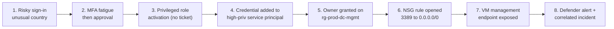
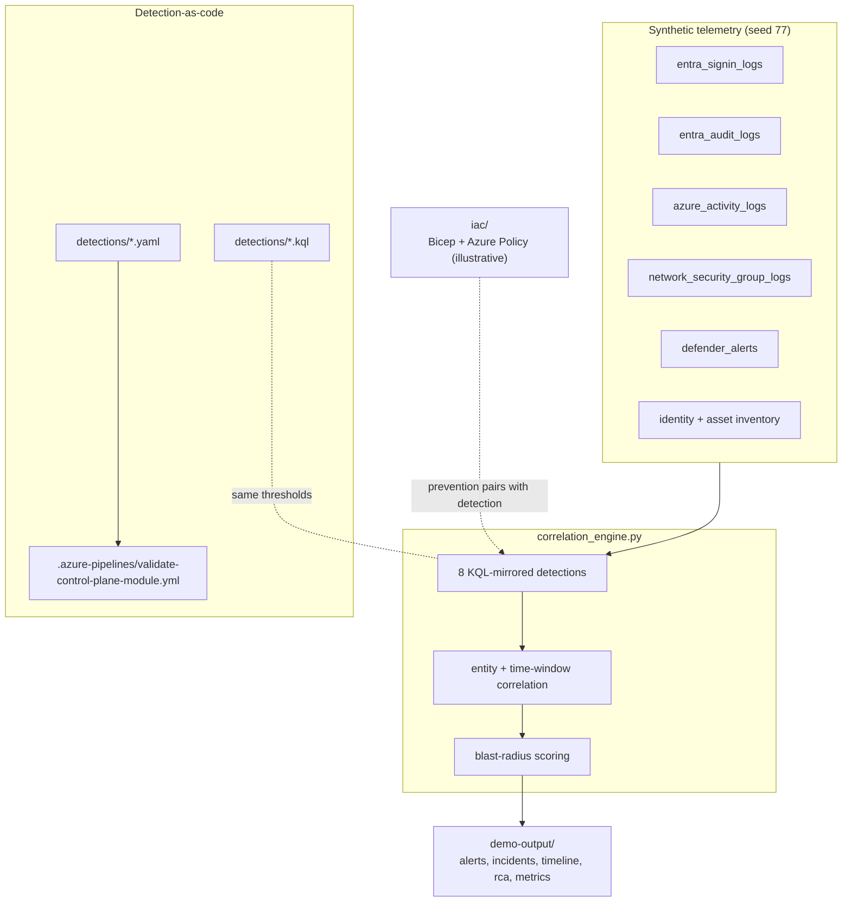
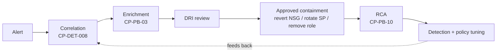

# Datacenter Control Plane Attack Path Lab

An advanced extension to the
[AI-Assisted Azure Identity Threat Detection & SOAR Lab](../../README.md) that
shows how **identity compromise becomes Azure infrastructure exposure** - and
how a Cloud Security Engineer detects, correlates, triages, contains and
hardens against it.

Where the parent lab stops at the identity plane, this module follows the
attacker across the bridge into the control plane: from a risky sign-in all the
way to a management port exposed to the internet, correlated into a single
Critical incident with a blast-radius score.

Everything is synthetic and offline (generator seed 77). This is a lab that
mirrors Microsoft Sentinel and Azure concepts - it is not a production Sentinel
deployment.

## What it demonstrates

- Identity-to-cloud attack-path thinking (the incidents CO+I actually cares about)
- Eight detections spanning Entra ID, Azure Activity, NSG and Defender telemetry
- Correlation across **identity, service principal and resource scope** - not just by user
- Explainable **blast-radius scoring** (identity privilege, SP permissions, public exposure, asset criticality, resource count)
- SOAR response with strict automate-vs-approve boundaries for **network and RBAC changes**
- Detection-to-prevention: Azure Policy that denies the exposure the detection catches
- The full lifecycle: alert -> correlate -> enrich -> DRI review -> approved containment -> RCA -> tuning

## The attack chain



Identity -> Privileged Role -> Service Principal -> Subscription/RG -> NSG/Firewall
-> VM/Management Endpoint. Each step is a real telemetry event; together they are
one incident.

## System architecture



## Response flow



## Run it

```bash
python3 modules/datacenter-control-plane/src/main.py --demo
```

Standard library only. It generates the telemetry, runs the eight detections,
correlates them, scores blast radius, and writes five artefacts to
`demo-output/`.

Expected result: **8 alerts** across the seven telemetry stages, correlated
into **one Critical incident** (CP-INC-2001) spanning all seven stages with a
**blast-radius score of 100/100**.

Validation and tests (needs the repo's dev dependencies):

```bash
python3 modules/datacenter-control-plane/src/validate_module.py   # detection-as-code gate
python3 -m pytest modules/datacenter-control-plane/tests -q       # 12 tests
```

## The eight detections

| ID | Detection | Data source | MITRE | Severity |
|----|-----------|-------------|-------|----------|
| CP-DET-001 | Risky sign-in from unusual location | SigninLogs | T1078.004 | High |
| CP-DET-002 | MFA fatigue leading to approval | SigninLogs | T1621 | Critical |
| CP-DET-003 | Privileged role activation without change record | AuditLogs | T1098.003 | High |
| CP-DET-004 | Credential added to high-privilege service principal | AuditLogs | T1098.001 | Critical |
| CP-DET-005 | Subscription/resource group permission change | AzureActivity | T1098.003 | High |
| CP-DET-006 | NSG or firewall opened to the internet | AzureActivity | T1562.007 | Critical |
| CP-DET-007 | VM management endpoint exposed | AzureActivity | T1133 | Critical |
| CP-DET-008 | Correlated identity-to-control-plane chain | Correlation | (6 techniques) | Critical |

Each detection is a KQL query (`detections/*.kql`), a detection-as-code YAML
rule with false-positive and response guidance (`detections/*.yaml`), and a
mirrored Python function in `src/correlation_engine.py`.

## Deliberate benign cases (why it does not just alert on everything)

The telemetry includes benign noise that must **not** fire:

- an internal-only NSG rule change (10.0.0.0/8) - CP-DET-006/007 stay silent;
- a credential added to a **low**-privilege service principal - CP-DET-004 stays silent;
- a ticketed deployment by the automation principal - no permission-change alert.

Tests assert each of these, so the module demonstrates precision, not just recall.

## Blast-radius scoring

CP-DET-008 scores each incident 0-100 across five explainable factors, so the
DRI sees *why* it is Critical:

| Factor | Max points | In this incident |
|--------|-----------|------------------|
| Identity privilege | 25 | privileged identity with PIM eligibility |
| Service principal permissions | 25 | high-privilege sp-infra-deploy in scope |
| Public exposure | 20 | management port reachable from the internet |
| Asset criticality | 20 | critical datacenter-management assets |
| Affected resources | 10 | multiple distinct resources |

## What to show in an interview

Open [demo-output/control_plane_timeline.md](demo-output/control_plane_timeline.md)
- it walks the whole chain chronologically with the blast-radius breakdown and
the response flow, and it is the single best artefact for explaining
identity-to-cloud attack-path thinking in two minutes. The talk track is in
[docs/DATACENTER_CONTROL_PLANE_TALK_TRACK.md](../../docs/DATACENTER_CONTROL_PLANE_TALK_TRACK.md).

## Honest scope

My production strength is identity and privileged access security. I built this
extension to show how I *think* about identity-driven cloud infrastructure risk
and to prepare for this role. The KQL targets real Sentinel table schemas and
the Bicep/Policy under `iac/` is illustrative, not a deployment I have run at
scale. See [RESPONSIBLE_AUTOMATION.md](RESPONSIBLE_AUTOMATION.md) for the
automation boundaries.

## Module structure

```
modules/datacenter-control-plane/
├── README.md
├── RESPONSIBLE_AUTOMATION.md
├── data/                     synthetic telemetry (7 JSON files, regenerable)
├── detections/               8 x KQL + 8 x YAML detection-as-code rules
├── src/
│   ├── generate_telemetry.py deterministic telemetry generator
│   ├── correlation_engine.py 8 detections + correlation + blast radius
│   ├── main.py               entry point (--demo)
│   └── validate_module.py    detection-as-code CI gate
├── playbooks/                10 SOAR playbook designs + automation matrix
├── iac/                      illustrative Bicep + Azure Policy
├── demo-output/              committed sample run artefacts
└── tests/                    12 tests
```
