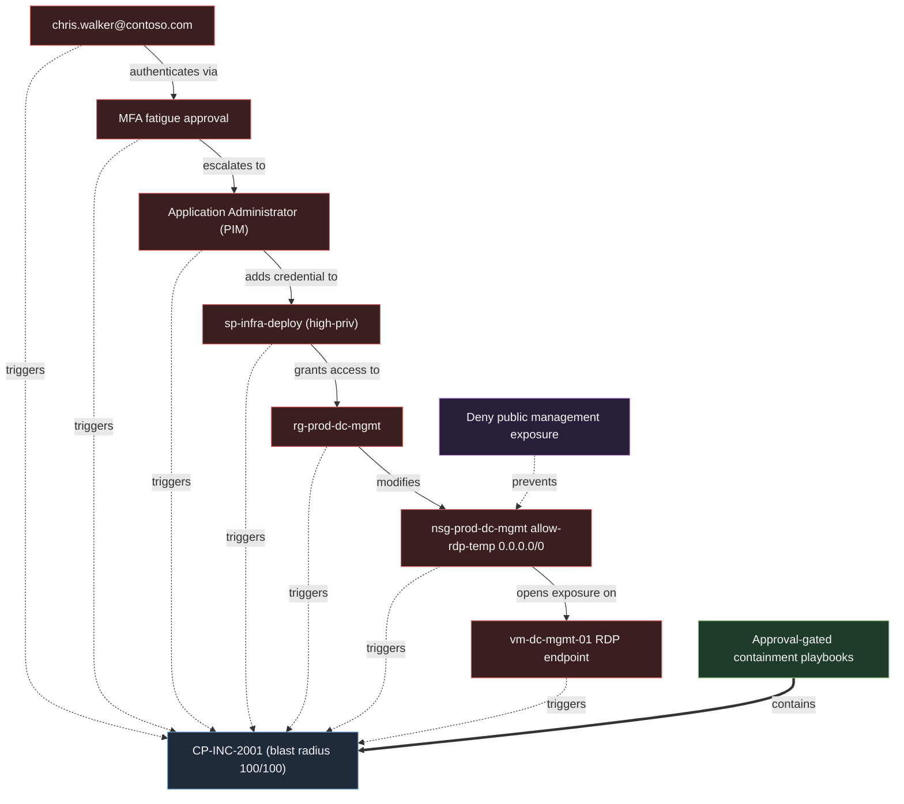

# Attack Path Graph

The datacenter control-plane scenario (incident **CP-INC-2001**) as a graph, not a list of alerts. This is the artefact that shows attack-path reasoning: how a single compromised identity walks across identity, RBAC and networking boundaries, where the detections observe it, and where a single control breaks the chain.

Machine-readable source: [attack-path-graph.json](attack-path-graph.json). Regenerate this diagram with `python3 security-engineering/render_attack_graph.py`.

## The graph

Legend: red = attacker moves, blue (dotted) = detection triggers, green (bold) = response containment, purple (dotted) = prevention control.

## Attacker path

`chris.walker@contoso.com -> MFA -> Application -> sp-infra-deploy -> rg-prod-dc-mgmt -> nsg-prod-dc-mgmt -> vm-dc-mgmt-01`

Each hop is a real telemetry event in the lab; together they are one incident. Reading it as a path rather than seven alerts is the whole point - it is the difference between triaging noise and seeing an attacker walk toward the crown jewels.

## Nodes

| Node | Type | Role in the story |
|------|------|-------------------|
| chris.walker@contoso.com | user_identity | attacker-controlled step |
| MFA fatigue approval | mfa_event | attacker-controlled step |
| Application Administrator (PIM) | privileged_role | attacker-controlled step |
| sp-infra-deploy (high-priv) | service_principal | attacker-controlled step |
| rg-prod-dc-mgmt | resource_group | attacker-controlled step |
| nsg-prod-dc-mgmt allow-rdp-temp 0.0.0.0/0 | nsg_rule | attacker-controlled step |
| vm-dc-mgmt-01 RDP endpoint | vm_management_endpoint | attacker-controlled step |
| CP-INC-2001 (blast radius 100/100) | incident | where the chain is seen |
| Approval-gated containment playbooks | soar_playbook | how it is contained |
| Deny public management exposure | azure_policy | how it is stopped next time |

## Edges

| From | Relation | To |
|------|----------|----|
| chris.walker@contoso.com | authenticates via | MFA fatigue approval |
| MFA fatigue approval | escalates to | Application Administrator (PIM) |
| Application Administrator (PIM) | adds credential to | sp-infra-deploy (high-priv) |
| sp-infra-deploy (high-priv) | grants access to | rg-prod-dc-mgmt |
| rg-prod-dc-mgmt | modifies | nsg-prod-dc-mgmt allow-rdp-temp 0.0.0.0/0 |
| nsg-prod-dc-mgmt allow-rdp-temp 0.0.0.0/0 | opens exposure on | vm-dc-mgmt-01 RDP endpoint |
| chris.walker@contoso.com | triggers | CP-INC-2001 (blast radius 100/100) |
| MFA fatigue approval | triggers | CP-INC-2001 (blast radius 100/100) |
| Application Administrator (PIM) | triggers | CP-INC-2001 (blast radius 100/100) |
| sp-infra-deploy (high-priv) | triggers | CP-INC-2001 (blast radius 100/100) |
| rg-prod-dc-mgmt | triggers | CP-INC-2001 (blast radius 100/100) |
| nsg-prod-dc-mgmt allow-rdp-temp 0.0.0.0/0 | triggers | CP-INC-2001 (blast radius 100/100) |
| vm-dc-mgmt-01 RDP endpoint | triggers | CP-INC-2001 (blast radius 100/100) |
| Approval-gated containment playbooks | contains | CP-INC-2001 (blast radius 100/100) |
| Deny public management exposure | prevents | nsg-prod-dc-mgmt allow-rdp-temp 0.0.0.0/0 |

## Earliest break point

**Deny public management exposure** - The Azure Policy denying public inbound on management ports would have blocked the nsg edge - breaking the chain before the management endpoint was ever exposed. Prevention beats detection at the last mile.

This is the analytical payoff of drawing the graph: it makes the highest-leverage control obvious. The chain has seven attacker edges, but the prevention control severs the last and most damaging one before it happens - which is why the RCA recommends deploying it, not just adding another detection.
