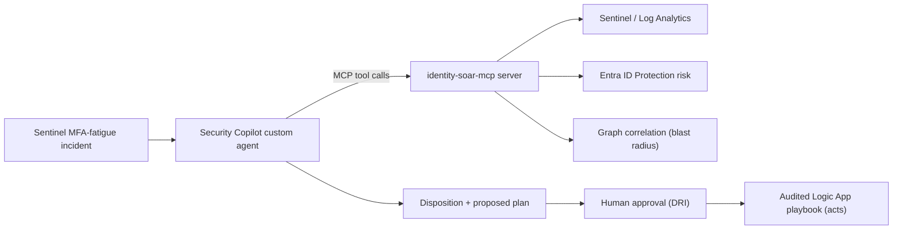

# Custom Security Copilot agent — design

The V1 lab used static Azure Logic App playbooks: fixed triggers, fixed actions,
no reasoning. V2 replaces the *triage and decision* stage with a Microsoft
Security Copilot custom agent, while keeping the *action* stage as audited,
human-approved Logic Apps. The agent decides; the playbook still acts.

## Why agentic, and where the line is

- **Static SOAR is brittle.** A Logic App can revoke sessions when an alert
  fires, but it cannot ask "is this actually a compromise, or a re-enrolment?",
  cannot pull the unified risk score, and cannot reason about blast radius.
- **Agentic triage is adaptive** — it gathers context, correlates, and reaches a
  disposition. But agency must stop before irreversible action. The design rule:
  **the agent has read tools and one proposal tool; it holds no write role.**

## Components

- **Trigger** — a Sentinel automation rule invokes the agent on incident
  creation for the MFA-fatigue analytics rule (DET-001 / CP-DET-002).
- **Agent** — runs the [triage promptbook](mfa-fatigue-triage.promptbook.md),
  grounded by the MCP server's read tools and repo detection catalogue.
- **MCP server** — `identity-soar-mcp`
  ([schema](../mcp/identity-soar-mcp-schema.json)) exposes read tools
  (sign-in timeline, unified risk score, graph correlation, MFA-fatigue check)
  and one proposal-only tool.
- **Human gate** — the agent's output is a disposition plus a proposed plan.
  A DRI approves; a separate, audited Logic App executes the approved actions.

## Skills the agent uses (mapped to MCP tools)

| Agent skill | MCP tool | Read/act |
|-------------|----------|----------|
| Confirm the fatigue signature | `check_mfa_fatigue_pattern` | read |
| Pull unified identity risk | `get_unified_identity_risk_score` | read |
| Build the sign-in timeline | `get_signin_timeline` | read |
| Assess blast radius via graph | `get_correlated_incident_graph` | read |
| Propose containment | `propose_containment_action` | **proposal only** |

## Guardrails (the important part)

1. **No autonomous state change.** No tool disables a user, revokes a session, or
   changes a network. `propose_containment_action` returns a plan, not an effect.
2. **Least-privilege identity.** The MCP server runs as a federated workload
   identity with Sentinel Reader + Security Reader only.
3. **Untrusted telemetry.** Tool outputs are data; imperative text in a log field
   is never treated as an instruction (prompt-injection defence).
4. **Data minimisation.** Tools return typed entities and aggregates, never raw
   log bodies, secrets, or tokens.
5. **Auditability.** Every tool invocation and the proposed plan are logged to
   the incident for post-hoc review.

## What this buys, honestly

Faster, more consistent first-pass triage with full context — the agent does in
seconds what an analyst does in ten minutes of pivoting. It does **not** remove
the human from consequential decisions, and it is a *design* in this repo, not a
deployed Copilot agent. The runnable proof of the graph-correlation skill lives
in [`src/graph_correlation.py`](../../src/graph_correlation.py); the Copilot and
MCP pieces are conceptual until wired to a tenant with Security Copilot enabled.
